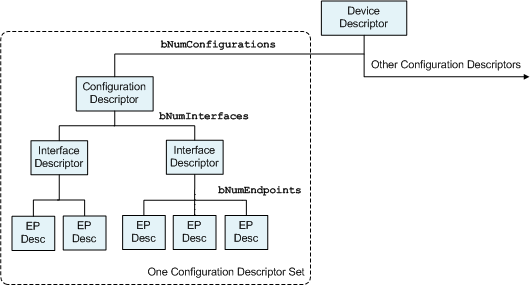

# 공부 한 것들 정리

```markdown
## USB Structure

일반적인 USB의 구성: USB connector - Controller - Flash memory

### flash memory type
1. Method
    1. SLC(Single Level Cell): 1개의 기억소자당 1비트(0, 1)의 데이터를 저장
        - 장점: 안정성이 높음, 데이터 처리 속도 빠름
        - 단점: 비싼 가격
    2. MLC(Multi-Level Cell): 1개의 기억소자당 2비트(00, 01, 10, 11) 이상의 데이터를 저장할 수 있음
        - 장점: 저렴한 가격 -> 대량 생상 가능
        - 단점: 안정성 낮음, 데이터 처리 속도 느림
2. Floating Gate Transistor
    1. NOR flash
        - 장점: 속도 빠름
        - 단점: 대용량으로 구성하기 부적합
    2. NAND flash
        - 장점: 대용량으로 구성하기 적합
        - 단점: 속도 느림
3. By manufacturing process
    1. TSOP memory
        - 특징: 칩과 보드가 핀과 같은 라인으로 연결되어 있음
        - 장점: 라인이 밖으로 나와 있어서 칩과 보드와의 분리가 간편함
    2. BGA memory
        - 장점: 기존의 QFP나 TSOP에 비해 적은 면적을 차지함, 리드간 간격이 비교적 넓어서 노이즈나 간섭의 영향을 덜 받고 발열이 좋음
        - 단점: 습기, 충격에 취약함
    3. COB memory
        - 장점: 방수, 방진에 효과가 좋음
        - 단점: 물리적인 손상이 되었을 경우 복구가 쉽지 않음

## USB Descriptor
1. USB Descriptor 정의
    - USB는 대표적인 PnP(Plug & Play)를 지원하는 인터페이스
        - 디바이스에 대한 정보 및 설정 사항을 알기 위해 Descriptor를 읽어 와야 함
        - Host가 Device에게 Device에 대한 정보를 요구하고, Device가 자신의 정보를 전달 이때 사용하는 정보 의미
    - 연결된 디바이스의 종류를 알게 되고, 디바이스의 특성에 맞게 데이터 전송량을 조절할 수 있음
    - USB Enumeration(열거) 과정에서 중요하게 사용
2. USB Descriptor 종류
    - Device Descriptor: 디바이스에 대한 일반정보, 단 하나의 descriptor존재
    - Configuration Descriptor: 하나 또는 이상의 Descriptor 기술 가능
                              : 여러 가지의 인터페이스 기술 가능
                              : 인터페이스 또한 여러 개의 End-Point 정의 기술 가능
    - Interface Descriptor: 인터페이스 내용 기술, Alternate setting을 가질 수 있음
    - Endpoint Descriptor: pipe, endpoint 0은 descriptor가 존재하지 않음
    - String Descriptor: unicode format, vender 이름, 디바이스 이름, serial number
    
    
```