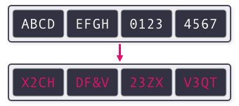

## Oraganize notes

### 현대 암호
 - 역사: 대칭키 암호 시스템은 도청의 위험이 있기 때문에 공유되는 키는 알지 못하게 하는 키 공유 알고리즘(Key exchange algorithm)을 연구함
    
-> 1970년 중반에 Diffie와 Hellman이 Diffie-Hellman 키교환 알고리즘을 제시하였고, 송신자와 수신자가 서로 다른 키를 사용하는 공개키 암호 시스템(Public key cryptosystem)의 개념을 창안함
    - 이는 대칭키와 대비되어 비대칭키 암호 시스템(Asymmetric cryptography)라고도 불림

 1. 케르크호프스의 원리
    - 설명: 오귀스트 케르크호프스(Auguste Kerckhoffs)가 집필한 군사용 암호의 원칙 중에서 2번째 항목

     -> 현대 암호 체계에서 중요한 의미를 가지고 있음

     1. 케르크호프스의 원리(Kerckhoffs' principle)
        - 키를 제외한 시스템의 다른 모든 내용이 알려지더라도 암호체계는 안전해야 한다.

    2. 혼돈(Confusion)과 확산(Diffusion)
         1. 혼돈(Confusion)
            - 설명: 암호문에서 평문의 특성을 알아내기 힘든 성질

        2. 확산(Diffsion)
            - 설명: 평문의 작은 변화가 암호문의 큰 변화로 이어지는 성질

### 대칭키 암호 시스템
 - 설명: 대칭키 암호 시스템은 암호화와 복호화에 같은 키를 사용하는 시스템
    -> 송신자와 수신자가 같은 키를 공유해야함

1. 블록 암호(Block cipher)
    - 설명: 평문을 정해진 크기의 블록 단위로 암호화하는 암호

    대표적인 예시: DES 대칭키 암호와 AES 대칭키 암호

    만약 평문의 크기가 블록 크기의 배수가 아니어서 블록으로 균등하게 쪼갤 수 없다면, 평문 뒤에 데이터를 추가하는 패딩(Padding)을 먼저 수행함

    -> 패딩은 평문이 블록 크기의 배수가 될 때까지 데이터를 추가함

 2. 스트림 암호(Stream cipher)
    - 설명: 송신자와 수신자가 공유하는 데이터 스트림을 생성하고 이를 평문과 특정한 연산을 수행하여 암호문을 생성하는 암호

    -> 복호화 과정은 암호화 과정의 연산을 역으로 수행하여 진행됨

    - 대부분의 상황에서는 암호화 과정과 복호화 과정에 XOR 연산을 사용함
        1. a ⊕ b의 값으로부터 a에 대한 정보를 알아낼 수 없다.
        2. a = (a ⊕ b) ⊕ b가 성립해 역연산이 동일하고, 정보 손실이 없다.

    - 복호화 방식
         1. 평문을 P, 암호문을 C, 스트림을 X라고 할 때, 암호문 C는 C = P ⊕ X로 생성됨
        2. X ⊕ X = 0이므로 수신자는 C ⊕ X = P ⊕ X ⊕ X = P로 암호문을 복호화할 수 있음
            - 여기서 ⊕는 P와 X의 같은 위치의 모든 비트를 XOR 연산을 수행하는 것을 의미함

    - 뻘짓이 될 수 있음 -> 평문과 같은 길이의 스트림을 계속 공유할 수 있다면, 스트림을 공유하는 채널로 평문을 공유하면 됨
        -> 그래서 일반적으로 송수신자는 스트림을 공유하는 대신, 시드(Seed)라 불리는 값을 공유하고, 이를 사전에 합의된 함수의 인자로 넣어 스트림을 각자 생성함

    - 스트림 암호의 장점: 단순한 연산만으로만 구현되므로 속도가 매우 빨라 연산 능력이 부족한 임베디드 기기나 속도가 중요한 환경에서 사용함

- 대칭키 암호 시스템의 장단점
    - 장점: 일반적으로 공개키 암호 시스템에 비해 속도가 빠름

    - 단점: 송신자와 수신자가 사전에 키를 교환해야함, 그룹에 여러 명이 있을 경우 서로 다른 키를 생성해서 사용해야 함 -> 키 생성의 불편함

### 공개키 암호 시스템
- 키 쌍(Key Pair)
    1. 공개키(Public Key)
        - 모두에게 공개되어 있기 때문에 공개키를 아는 사람은 누구나 수신자에게 암호문을 보낼 수 있음

    2. 비밀키(Private Key)
        - 개인키는 수신자만 알고 있으므로, 공격자는 암호문을 도청해도 이를 복화할 수 없음

    -> 흐름: 송싱자는 수신자의 공개키(Public Key)로 데이터를 암호화하여 수신자에게 전송하고, 수신자는 자신의 비밀키(Private Key)로 이를 복호화함

 - 대칭키 암호와의 차이점: 서로 다른 키를 사용함
    -> 공개키 암호 시스템 = 비대칭키 암호 시스템

- 공개키 암호 시스템의 장단점
    - 장점: 그룹 내의 사람들이 각자의 공개키와 비밀키를 만든 후 공개키만 공개하면 됨, 새로운 상대와 통신하더라도 자신의 키를 다시 만들 필요 없음

    - 단점: 일반적으로 대칭키 암호 시스템에 비해 다소 복잡한 연산이 필요하므로 속도가 느림, 긴 키 길이로 인한 전송 데이터 양 증가

### 암호의 기능
- 정보 보안에는 여러 목표가 있는데, 현대 암호학은 기밀성 외에도 여러 목표의 달성에 기여하고 있음
    
    1. 기밀성(Confidentiality)
        - 허가된 사람만이 정보를 열람할 수 있게 하는 기능을 의미 -> 여기서 허락된 사람은 일반적으로 키를 가지고 있는 사람을 의미

    2. 무결성(Integrity)
        - 송신자가 보낸 정보에 변조가 일어나지 않았음을 의미

    3. 인증(Authentication)
        - 정보를 주고 받는 상대방의 신원을 확인하는 기능

    4. 부인 방지(Non-repudiation)
        - 정보를 교환한 이후에 교환한 사실을 부인할 수 없게 하는 기능